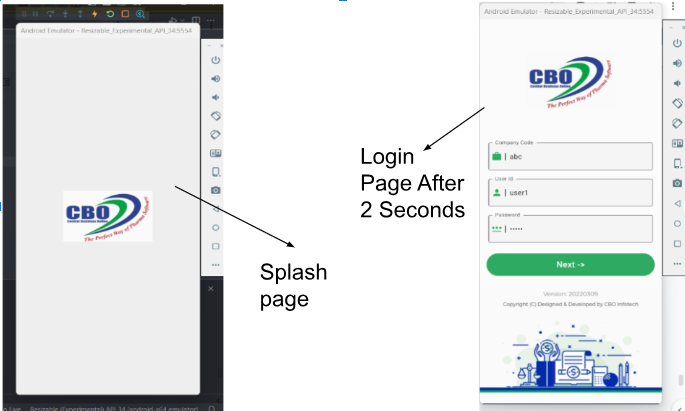
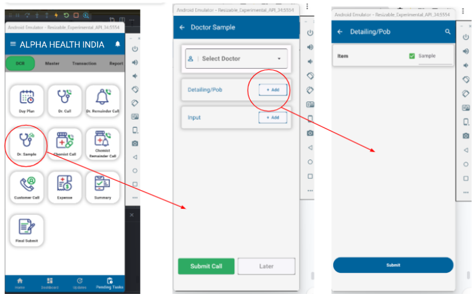

<----------------------------------------------||||||||||||||||||||||||||---------------------------------------------->

USER GUIDE:
1. Creating the virtual environement and then installing the requirements.txt from location "ERPApp\django_backend\requirements.txt" for backend.

2. Installing Flutter and related dependencies(like flutter doctor, andriod emulator, sdk packages).

<----------------------------------------------||||||||||||||||||||||||||---------------------------------------------->

The App Structure contains:

Django_backend:
---contains two app models:
   --- company which contains the pharma company  association models like doctor, chemist and customer and the realted     
       serializers, the urls and views for API, which can be later modified as per client requirement.
   --- accounts which contains the custom user model and user manager , the serialzers , the urls and the views for the API and 
       the admin registration file.
       This custom user model includes all user details of the registered user.
       The API includes usercreation , userlogin and userlogout endpoints.
   --- "ERPApp\django_backend\django_backend\settings.py" defines all the host allowed, app models created, database 
        connectivity, etc.

Flutter_Frontend:
--- "ERPApp\flutter_frontend\lib\app_screens" contains the appscreens for the frontend, in so addition of further screens can be  
    done here.
--- "ERPApp\flutter_frontend\lib\custom_routes" contains the routing information for the appsreens, it includes the constant.dart 
    routes.dart which can be modified with further increases in appscreeens.
--- pubspec.yaml is to define all the packages and dependencies used in the project. 

A pharma ERPAPP is created using flutter for the frontend, Django for the backend and DjangoREST for creating the APIs. 

